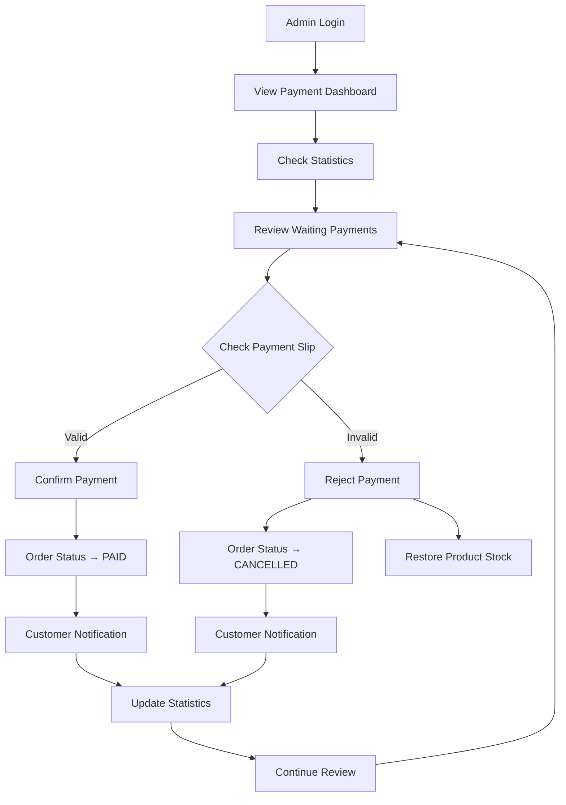

# Admin Payment Management Guide
## คู่มือการจัดการการชำระเงินสำหรับผู้ดูแลระบบ

> คู่มือการใช้งานระบบจัดการการชำระเงินสำหรับ Admin

---

## 🎯 Overview

ระบบจัดการการชำระเงินสำหรับ Admin ประกอบด้วย:
- **Payment Statistics Dashboard** - สถิติการชำระเงิน
- **Payment Management Table** - ตารางจัดการการชำระเงิน
- **Payment Detail Modal** - รายละเอียดการชำระเงิน
- **Quick Actions** - การดำเนินการด่วน
- **Bulk Operations** - การดำเนินการหลายรายการ

---

## 📁 File Structure

```
src/
├── app/admin/payment/
│   └── page.js                        # Admin payment page
├── module/admin/payment/
│   ├── AdminPaymentManager.js         # Main payment management
│   ├── PaymentStatistics.js          # Statistics dashboard
│   └── PaymentQuickActions.js         # Quick action tools
└── api/admin/payments/
    ├── route.js                       # Payment list API
    ├── statistics/route.js            # Statistics API
    └── [paymentId]/confirm/route.js   # Confirm/Reject API
```

---

## 🎨 UI Components

### 1. PaymentStatistics Component

**Features:**
- แสดงสถิติการชำระเงินแบบ Real-time
- การชำระเงินทั้งหมด, ยืนยันแล้ว, รอตรวจสอบ, ปฏิเสธ
- ยอดเงินรวม, ยอดที่ยืนยันแล้ว
- การชำระเงินและยอดเงินวันนี้
- อัตราการยืนยันและปฏิเสธ (Progress Bar)

**Key Metrics:**
```javascript
{
  totalPayments: 150,        // การชำระเงินทั้งหมด
  confirmedPayments: 120,    // ยืนยันแล้ว
  waitingPayments: 25,       // รอตรวจสอบ
  rejectedPayments: 5,       // ปฏิเสธ
  totalAmount: 450000,       // ยอดรวมทั้งหมด
  confirmedAmount: 380000,   // ยอดที่ยืนยันแล้ว
  todayPayments: 12,         // การชำระวันนี้
  todayAmount: 35000         // ยอดวันนี้
}
```

### 2. AdminPaymentManager Component

**Features:**
- ตารางแสดงรายการการชำระเงิน
- แบ่งแท็บตามสถานะ (รอตรวจสอบ, ยืนยันแล้ว, ปฏิเสธ)
- Pagination สำหรับข้อมูลจำนวนมาก
- ดูรายละเอียดการชำระเงิน
- ยืนยัน/ปฏิเสธการชำระเงิน

**Table Columns:**
- หมายเลขการชำระ
- หมายเลขคำสั่งซื้อ
- ชื่อลูกค้า
- ยอดเงิน
- สถานะ
- วันที่อัปโหลดสลิป
- วันที่ยืนยัน
- การดำเนินการ

### 3. PaymentQuickActions Component

**Features:**
- ยืนยันหลายรายการพร้อมกัน
- ปฏิเสธหลายรายการพร้อมกัน
- ค้นหาขั้นสูง
- รีเฟรชข้อมูล

---

## 🔧 API Endpoints

### 1. Get Payment List

```javascript
GET /api/admin/payments?status=WAITING&page=1&pageSize=20

Response: {
  "payments": [
    {
      "id": 123,
      "amount": 1500.00,
      "status": "WAITING",
      "slipUrl": "/uploads/slips/slip_123.jpg",
      "paymentDate": "2024-01-15T10:30:00Z",
      "confirmedAt": null,
      "order": {
        "id": 456,
        "customer": {
          "name": "John Doe",
          "email": "john@example.com",
          "phone": "0812345678"
        },
        "orderItems": [...]
      }
    }
  ],
  "total": 25,
  "page": 1,
  "pageSize": 20,
  "totalPages": 2
}
```

### 2. Get Payment Statistics

```javascript
GET /api/admin/payments/statistics

Response: {
  "totalPayments": 150,
  "confirmedPayments": 120,
  "waitingPayments": 25,
  "rejectedPayments": 5,
  "totalAmount": 450000,
  "confirmedAmount": 380000,
  "todayPayments": 12,
  "todayAmount": 35000
}
```

### 3. Confirm/Reject Payment

```javascript
POST /api/admin/payments/123/confirm
Body: {
  "action": "confirm", // or "reject"
  "note": "Payment verified successfully"
}

Response: {
  "success": true,
  "message": "Payment confirmed successfully"
}
```

---

## 🔄 Admin Workflow

### 1. Daily Payment Review Process



### 2. Bulk Operations Workflow

```mermaid
graph TD
    A[Select Bulk Action] --> B[Enter Payment IDs]
    B --> C[Add Note (Optional)]
    C --> D[Confirm Action]
    D --> E[Process Each Payment]
    E --> F[Update Order Status]
    F --> G[Update Stock (if rejected)]
    G --> H[Send Notifications]
    H --> I[Update Statistics]
    I --> J[Show Results]
```

---

## 📊 Payment Status Management

### Status Flow
```
WAITING (รอตรวจสอบ)
    ↓
Admin Review
    ↓
CONFIRMED ✅ หรือ REJECTED ❌
```

### Status Actions
- **WAITING → CONFIRMED**
  - อัปเดต `payments.status = 'CONFIRMED'`
  - อัปเดต `payments.confirmedAt = NOW()`
  - อัปเดต `orders.status = 'PAID'`
  - ส่งการแจ้งเตือนให้ลูกค้า

- **WAITING → REJECTED**
  - อัปเดต `payments.status = 'REJECTED'`
  - อัปเดต `orders.status = 'CANCELLED'`
  - คืนสต็อกสินค้า (`products.stock += quantity`)
  - บันทึก `stock_movements` (type: 'IN')
  - ส่งการแจ้งเตือนให้ลูกค้า

---

## 🔍 Payment Verification Guidelines

### ✅ Valid Payment Slip Criteria

1. **ข้อมูลครบถ้วน**
   - วันที่และเวลาการโอน
   - ยอดเงินตรงกับคำสั่งซื้อ
   - เลขที่บัญชีปลายทางถูกต้อง
   - ชื่อบัญชีปลายทางถูกต้อง

2. **คุณภาพรูปภาพ**
   - รูปภาพชัดเจน อ่านได้
   - ไม่มีการตัดต่อหรือแก้ไข
   - แสงเพียงพอ ไม่มีเงาบัง

3. **ความถูกต้องของข้อมูล**
   - ยอดเงินตรงกับ Order Amount
   - วันที่โอนไม่เกิน 7 วัน
   - บัญชีปลายทางเป็นบัญชีของร้าน

### ❌ Invalid Payment Slip Criteria

1. **ข้อมูลไม่ครบถ้วน**
   - ไม่มีวันที่หรือเวลา
   - ยอดเงินไม่ตรง
   - เลขบัญชีผิด

2. **คุณภาพรูปภาพไม่ดี**
   - รูปเบลอ อ่านไม่ได้
   - รูปมืด หรือสว่างเกินไป
   - รูปไม่ครบ ตัดขอบ

3. **ข้อมูลผิดพลาด**
   - โอนไปบัญชีผิด
   - ยอดเงินไม่ถูกต้อง
   - สลิปหมดอายุ

---

## 🛡️ Security & Audit

### Admin Activity Logging

```javascript
// บันทึกการดำเนินการของ Admin
{
  "adminId": 1,
  "action": "confirm_payment",
  "tableName": "payments",
  "recordId": 123,
  "oldValues": {"status": "WAITING"},
  "newValues": {"status": "CONFIRMED", "confirmedAt": "2024-01-15T10:30:00Z"},
  "ipAddress": "192.168.1.100",
  "userAgent": "Mozilla/5.0...",
  "notes": "Payment verified successfully",
  "createdAt": "2024-01-15T10:30:00Z"
}
```

### Permission Requirements

- **View Payments**: `view_payments`
- **Confirm Payments**: `manage_payments`
- **Reject Payments**: `manage_payments`
- **Bulk Operations**: `manage_payments` + `bulk_operations`
- **View Statistics**: `view_reports`

---

## 📱 Mobile Responsiveness

### Responsive Features
- ตารางแสดงผลได้ดีบนมือถือ
- การ์ดสถิติปรับขนาดอัตโนมัติ
- Modal รายละเอียดเหมาะกับหน้าจอเล็ก
- ปุ่มและการควบคุมขนาดเหมาะสม

### Mobile Optimizations
- Horizontal scroll สำหรับตาราง
- Collapsible columns บนหน้าจอเล็ก
- Touch-friendly buttons
- Optimized image viewing

---

## 🔧 Configuration

### Admin Settings

```javascript
// src/config/admin.js
export const ADMIN_CONFIG = {
  PAYMENT_SETTINGS: {
    AUTO_REFRESH_INTERVAL: 30000,    // 30 seconds
    MAX_BULK_OPERATIONS: 50,         // Max items per bulk operation
    SLIP_IMAGE_MAX_SIZE: 5242880,    // 5MB
    PAYMENT_TIMEOUT_DAYS: 7,         // Days before payment expires
  },
  
  PERMISSIONS: {
    VIEW_PAYMENTS: 'view_payments',
    MANAGE_PAYMENTS: 'manage_payments',
    BULK_OPERATIONS: 'bulk_operations',
    VIEW_REPORTS: 'view_reports',
  },
  
  NOTIFICATION_SETTINGS: {
    EMAIL_ON_CONFIRM: true,
    EMAIL_ON_REJECT: true,
    SMS_NOTIFICATIONS: false,
  }
};
```

---

## 🧪 Testing Scenarios

### 1. Payment Confirmation Testing

```javascript
// Test Cases:
1. Confirm valid payment → Order status updates to PAID
2. Reject invalid payment → Order cancelled, stock restored
3. Bulk confirm multiple payments → All processed correctly
4. Confirm already confirmed payment → Error handling
5. Network failure during confirmation → Rollback handling
```

### 2. Statistics Accuracy Testing

```javascript
// Test Cases:
1. Statistics update after payment confirmation
2. Real-time statistics refresh
3. Date range calculations (today's payments)
4. Percentage calculations (confirmation rate)
5. Large dataset performance
```

---

## 🚀 Performance Optimization

### Database Optimization
- Index on `payments.status` for fast filtering
- Index on `payments.createdAt` for date queries
- Pagination to limit query results
- Eager loading for related data

### Frontend Optimization
- Virtual scrolling for large tables
- Image lazy loading for payment slips
- Debounced search functionality
- Cached statistics data

---

## 📞 Support & Troubleshooting

### Common Issues

1. **Statistics not updating**
   - Check API endpoint connectivity
   - Verify database indexes
   - Clear browser cache

2. **Payment confirmation fails**
   - Check admin permissions
   - Verify payment status
   - Check database transaction logs

3. **Bulk operations timeout**
   - Reduce batch size
   - Check server timeout settings
   - Monitor database performance

### Monitoring

- Payment processing times
- Admin response times
- Error rates and types
- Database query performance

---

*สร้างโดย: E-commerce Development Team*  
*อัปเดตล่าสุด: มกราคม 2024*