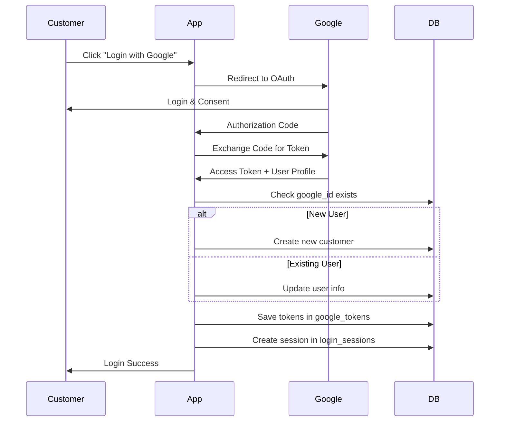
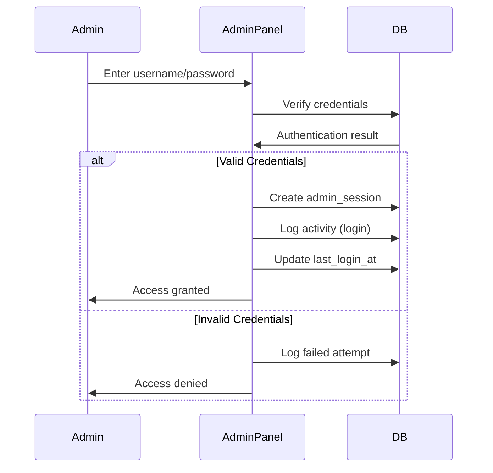

# E-commerce Database Schema

> ระบบฐานข้อมูลสำหรับเว็บไซต์ E-commerce ที่รองรับการล็อกอินด้วย Google OAuth เท่านั้น

## 📋 Table of Contents
- [Overview](#overview)
- [Database Schema](#database-schema)
- [Authentication System](#authentication-system)
- [Core Features](#core-features)
- [Installation](#installation)
- [Usage Examples](#usage-examples)
- [Security Considerations](#security-considerations)

## 🎯 Overview

ฐานข้อมูลนี้ออกแบบมาสำหรับระบบ E-commerce ที่มีคุณสมบัติหลัก:
- **Google OAuth Login** เป็นระบบล็อกอินเดียว
- **Product Management** จัดการสินค้าและหมวดหมู่
- **Order Processing** ระบบสั่งซื้อและชำระเงิน
- **Stock Management** จัดการสต็อกสินค้า
- **Promotion System** ระบบโปรโมชั่นและส่วนลด

## 🗃️ Database Schema

### Core Tables

#### 🏷️ **categories**
```sql
category_id (PK) | name | description | deleted_at | created_at | updated_at
```
- จัดเก็บหมวดหมู่สินค้า
- รองรับ Soft Delete

#### 📦 **products** 
```sql
product_id (PK) | category_id (FK) | name | description | price | stock | image_url | deleted_at | created_at | updated_at
```
- ข้อมูลสินค้าทั้งหมด
- เชื่อมโยงกับหมวดหมู่
- ตรวจสอบราคาและสต็อกไม่ติดลบ

#### 🎁 **promotions**
```sql
promotion_id (PK) | product_id (FK) | discount_percent | start_date | end_date | is_active | max_usage | usage_count | created_at | updated_at
```
- ระบบโปรโมชั่นและส่วนลด
- จำกัดจำนวนการใช้งาน
- กำหนดช่วงเวลาโปรโมชั่น

### Authentication Tables

#### 👤 **customers**
```sql
customer_id (PK) | google_id (UNIQUE) | name | email (UNIQUE) | avatar_url | phone | address | deleted_at | created_at | updated_at
```
- ข้อมูลลูกค้าที่ล็อกอินผ่าน Google
- `google_id` เป็น Google User ID
- `avatar_url` รูปโปรไฟล์จาก Google

#### 👨‍💼 **admins**
```sql
admin_id (PK) | username (UNIQUE) | email (UNIQUE) | password_hash | name | role | avatar_url | is_active | last_login_at | created_at | updated_at
```
- ข้อมูลผู้ดูแลระบบ
- **Roles:** `super_admin`, `admin`, `moderator`
- ใช้ username/password login แยกจากลูกค้า

#### 🔑 **google_tokens**
```sql
token_id (PK) | customer_id (FK) | access_token | refresh_token | token_expires_at | created_at | updated_at
```
- เก็บ Google Access Token และ Refresh Token
- ใช้สำหรับเรียก Google API

#### 🖥️ **login_sessions** / **admin_sessions**
```sql
session_id (PK) | customer_id/admin_id (FK) | ip_address | user_agent | last_activity | expires_at | created_at
```
- จัดการ Session ของผู้ใช้และ Admin แยกกัน
- ติดตาม IP และ User Agent

#### 📋 **admin_activities**
```sql
activity_id (PK) | admin_id (FK) | action | table_name | record_id | old_values | new_values | ip_address | user_agent | created_at
```
- **Audit Log** ติดตามการกระทำของ Admin ทั้งหมด
- เก็บค่าเก่า-ใหม่เป็น JSON
- ติดตาม IP และเวลาในการกระทำ

#### 🔐 **admin_permissions**
```sql
permission_id (PK) | admin_id (FK) | permission_name | granted_by (FK) | granted_at
```
- จัดการสิทธิ์ Admin แบบละเอียด
- **Permissions:** `manage_products`, `manage_orders`, `view_reports`, `manage_users`

### Order Management Tables

#### 🛒 **orders**
```sql
order_id (PK) | customer_id (FK) | status | total_amount | created_at | updated_at
```
**Order Status:**
- `pending_payment` - รอชำระเงิน
- `waiting_confirm` - รอยืนยันการชำระ
- `paid` - ชำระเงินแล้ว
- `shipping` - กำลังจัดส่ง
- `completed` - เสร็จสิ้น
- `cancelled` - ยกเลิก

#### 📝 **order_items**
```sql
order_item_id (PK) | order_id (FK) | product_id (FK) | quantity | price | 
```
- รายการสินค้าในแต่ละออเดอร์
- เก็บราคาขณะที่สั่งซื้อ

#### 💰 **payments**
```sql
payment_id (PK) | order_id (FK) | amount | payment_date | slip_url | status | confirmed_at | created_at | updated_at
```
**Payment Status:**
- `waiting` - รอตรวจสอบ
- `confirmed` - ยืนยันแล้ว
- `rejected` - ปฏิเสธ

#### 🚚 **shippings**
```sql
shipping_id (PK) | order_id (FK) | courier | tracking_number | status | shipped_at | delivered_at | created_at | updated_at
```
**Shipping Status:**
- `preparing` - เตรียมของ
- `shipped` - จัดส่งแล้ว
- `delivered` - ส่งถึงแล้ว

### Stock Management

#### 📊 **stock_movements**
```sql
movement_id (PK) | product_id (FK) | type | quantity | reference_type | reference_id | notes | created_at
```
**Movement Types:**
- `in` - เพิ่มสต็อก
- `out` - ลดสต็อก  
- `adjustment` - ปรับปรุงสต็อก

**Reference Types:**
- `purchase` - ซื้อเข้า
- `sale` - ขายออก
- `adjustment` - ปรับปรุง
- `return` - คืนสินค้า

## 🔐 Authentication System

### Customer Authentication (Google OAuth)



### Admin Authentication (Traditional Login)



### Admin Role & Permission System

#### **Admin Roles:**
- **super_admin** - เข้าถึงได้ทุกอย่าง รวมถึงจัดการ admin อื่น
- **admin** - จัดการสินค้า คำสั่งซื้อ ลูกค้า
- **moderator** - ดูข้อมูลและอัปเดตสถานะเท่านั้น

#### **Permission Examples:**
- `manage_products` - เพิ่ม/แก้ไข/ลบสินค้า
- `manage_orders` - จัดการคำสั่งซื้อ
- `manage_customers` - จัดการข้อมูลลูกค้า
- `manage_promotions` - จัดการโปรโมชั่น
- `view_reports` - ดูรายงานและสถิติ
- `manage_admins` - จัดการผู้ดูแลระบบ (super_admin เท่านั้น)

### Session Management
- **Customer Session:** 30 วัน
- **Admin Session:** 8 ชั่วโมง (security ที่เข้มงวดกว่า)
- Auto cleanup expired sessions
- Force logout ได้จากทุกอุปกรณ์

## ⚡ Core Features

### 🛍️ Product Management
- หมวดหมู่สินค้าแบบลำดับชั้น
- ระบบจัดการสต็อกแบบเรียลไทม์
- Soft delete สำหรับสินค้าและหมวดหมู่
- การติดตามการเปลี่ยนแปลงสต็อก

### 🎯 Promotion System
- ส่วนลดเป็นเปอร์เซ็นต์
- กำหนดช่วงเวลาโปรโมชั่น
- จำกัดจำนวนการใช้งาน
- เปิด/ปิดโปรโมชั่นได้

### 📋 Order Processing
- ระบบสถานะออเดอร์ครบถ้วน
- การชำระเงินผ่านสลิปโอนเงิน
- ระบบจัดส่งพร้อมเลขพัสดุ
- ประวัติการสั่งซื้อ

## 🚀 Installation

### 1. Create Database
```sql
CREATE DATABASE ecommerce_db CHARACTER SET utf8mb4 COLLATE utf8mb4_unicode_ci;
USE ecommerce_db;
```

### 2. Run Schema
Execute the SQL schema file to create all tables and indexes.

### 3. Insert Sample Data
```sql
-- Sample Categories
INSERT INTO categories (name, description) VALUES 
('Electronics', 'อุปกรณ์อิเล็กทรอนิกส์'),
('Fashion', 'เสื้อผ้าและแฟชั่น'),
('Books', 'หนังสือและนิตยสาร');

-- Sample Products
INSERT INTO products (category_id, name, description, price, stock) VALUES
(1, 'iPhone 15', 'สมาร์ทโฟนรุ่นล่าสุด', 35000.00, 50),
(2, 'T-Shirt Basic', 'เสื้อยืดพื้นฐาน', 299.00, 100),
(3, 'Learn SQL', 'หนังสือเรียน SQL', 450.00, 30);
```

## 💡 Usage Examples

### Admin Management

#### Create Admin Account
```sql
-- สร้าง Super Admin
INSERT INTO admins (username, email, password_hash, name, role) 
VALUES ('superadmin', 'admin@company.com', '$2y$10$hashed_password', 'Super Administrator', 'super_admin');

-- ให้สิทธิ์ทั้งหมด
INSERT INTO admin_permissions (admin_id, permission_name, granted_by) VALUES
(1, 'manage_products', 1),
(1, 'manage_orders', 1),
(1, 'manage_customers', 1),
(1, 'manage_promotions', 1),
(1, 'view_reports', 1),
(1, 'manage_admins', 1);
```

#### Admin Login & Activity Logging
```sql
-- ตรวจสอบการล็อกอิน
SELECT * FROM admins 
WHERE username = 'admin123' 
AND password_hash = '$2y$10$...' 
AND is_active = TRUE;

-- สร้าง session
INSERT INTO admin_sessions (session_id, admin_id, ip_address, user_agent, expires_at)
VALUES ('sess_abc123', 1, '192.168.1.100', 'Mozilla/5.0...', DATE_ADD(NOW(), INTERVAL 8 HOUR));

-- บันทึก activity
INSERT INTO admin_activities (admin_id, action, table_name, record_id, new_values, ip_address)
VALUES (1, 'login', 'admins', 1, '{"timestamp": "2024-08-21 10:00:00"}', '192.168.1.100');
```

#### Product Management with Audit
```sql
-- Admin สร้างสินค้าใหม่
INSERT INTO products (category_id, name, description, price, stock) 
VALUES (1, 'New Product', 'Description', 999.00, 100);

-- บันทึก activity
INSERT INTO admin_activities (admin_id, action, table_name, record_id, new_values, ip_address) VALUES
(1, 'create_product', 'products', LAST_INSERT_ID(), 
 '{"name": "New Product", "price": 999.00, "stock": 100}', '192.168.1.100');

-- Admin แก้ไขสินค้า (เก็บค่าเก่าและใหม่)
UPDATE products SET price = 899.00, stock = 95 WHERE product_id = 1;

INSERT INTO admin_activities (admin_id, action, table_name, record_id, old_values, new_values, ip_address) VALUES
(1, 'update_product', 'products', 1,
 '{"price": 999.00, "stock": 100}',
 '{"price": 899.00, "stock": 95}', 
 '192.168.1.100');
```

### Customer Registration (Auto via Google)
```sql
-- เมื่อผู้ใช้ล็อกอินผ่าน Google ครั้งแรก
INSERT INTO customers (google_id, name, email, avatar_url) 
VALUES ('google_user_123', 'John Doe', 'john@gmail.com', 'https://lh3.googleusercontent.com/...');

-- เก็บ Google Token
INSERT INTO google_tokens (customer_id, access_token, refresh_token, token_expires_at)
VALUES (1, 'encrypted_access_token', 'encrypted_refresh_token', '2024-12-31 23:59:59');
```

### Order Management by Admin
```sql
-- Admin ดูคำสั่งซื้อที่รอยืนยันการชำระเงิน
SELECT o.order_id, c.name, o.total_amount, p.slip_url, p.amount
FROM orders o
JOIN customers c ON o.customer_id = c.customer_id
JOIN payments p ON o.order_id = p.order_id
WHERE o.status = 'waiting_confirm' AND p.status = 'waiting';

-- Admin อนุมัติการชำระเงิน
UPDATE payments SET status = 'confirmed', confirmed_at = NOW() 
WHERE payment_id = 1;

UPDATE orders SET status = 'paid' WHERE order_id = 1;

-- บันทึก activity
INSERT INTO admin_activities (admin_id, action, table_name, record_id, old_values, new_values, ip_address) VALUES
(1, 'confirm_payment', 'payments', 1,
 '{"status": "waiting"}',
 '{"status": "confirmed", "confirmed_at": "2024-08-21 10:30:00"}',
 '192.168.1.100');
```

### Create Order
```sql
-- สร้างออเดอร์
INSERT INTO orders (customer_id, status, total_amount) 
VALUES (1, 'pending_payment', 35299.00);

-- เพิ่มรายการสินค้า
INSERT INTO order_items (order_id, product_id, quantity, price) VALUES
(1, 1, 1, 35000.00),
(1, 2, 1, 299.00);

-- อัปเดตสต็อก
UPDATE products SET stock = stock - 1 WHERE product_id IN (1, 2);

-- บันทึกการเคลื่อนไหวสต็อก
INSERT INTO stock_movements (product_id, type, quantity, reference_type, reference_id) VALUES
(1, 'out', -1, 'sale', 1),
(2, 'out', -1, 'sale', 1);
```

### Apply Promotion
```sql
-- สร้างโปรโมชั่นลด 10%
INSERT INTO promotions (product_id, discount_percent, start_date, end_date, max_usage) 
VALUES (1, 10.00, '2024-01-01', '2024-01-31', 100);

-- คำนวณราคาหลังส่วนลด
SELECT 
    p.name,
    p.price as original_price,
    p.price * (1 - pr.discount_percent/100) as discounted_price
FROM products p
JOIN promotions pr ON p.product_id = pr.product_id
WHERE pr.is_active = TRUE 
AND CURDATE() BETWEEN pr.start_date AND pr.end_date;
```

## 🔒 Security Considerations

### Token Security
- **เข้ารหัส Access Token และ Refresh Token** ก่อนเก็บในฐานข้อมูล
- ใช้ AES-256 encryption
- เก็บ encryption key แยกจากฐานข้อมูล

### Session Security
```sql
-- ลบ session หมดอายุ
DELETE FROM login_sessions WHERE expires_at < NOW();

-- ลบ session เก่าเมื่อล็อกอินใหม่
DELETE FROM login_sessions 
WHERE customer_id = ? AND session_id != ?;
```

### Data Protection
- ใช้ **HTTPS** ในการสื่อสารทั้งหมด
- **Validate input** ทุกครั้งก่อนเก็บลงฐานข้อมูล
- **Rate limiting** สำหรับ API calls
- **Regular backup** ฐานข้อมูล

### Privacy Compliance
- รองรับ **GDPR** และ **PDPA**
- Soft delete เพื่อเก็บประวัติการสั่งซื้อ
- สามารถลบข้อมูลลูกค้าถาวรได้เมื่อต้องการ

## 📈 Performance Optimizations

### Indexes
- Primary Keys และ Foreign Keys
- Email และ Google ID lookups
- Order status และ date ranges
- Product category และ price filtering

### Query Optimization
```sql
-- ดึงสินค้าพร้อมโปรโมชั่น
SELECT p.*, pr.discount_percent
FROM products p
LEFT JOIN promotions pr ON p.product_id = pr.product_id 
  AND pr.is_active = TRUE 
  AND CURDATE() BETWEEN pr.start_date AND pr.end_date
WHERE p.deleted_at IS NULL;

-- ดึงออเดอร์พร้อมรายละเอียด
SELECT o.*, c.name as customer_name, 
       GROUP_CONCAT(CONCAT(prod.name, ' x', oi.quantity)) as items
FROM orders o
JOIN customers c ON o.customer_id = c.customer_id
JOIN order_items oi ON o.order_id = oi.order_id
JOIN products prod ON oi.product_id = prod.product_id
GROUP BY o.order_id;
```

## 🛠️ Maintenance

### Regular Tasks
```sql
-- ลบ customer session หมดอายุ (รันทุกวัน)
DELETE FROM login_sessions WHERE expires_at < NOW();

-- ลบ admin session หมดอายุ (รันทุก 4 ชั่วโมง)
DELETE FROM admin_sessions WHERE expires_at < NOW();

-- ลบ token หมดอายุ (รันทุกสัปดาห์)
DELETE FROM google_tokens WHERE token_expires_at < NOW();

-- สร้างรายงาน Admin Activity (รันทุกวัน)
SELECT 
    a.name as admin_name,
    aa.action,
    COUNT(*) as action_count,
    DATE(aa.created_at) as activity_date
FROM admin_activities aa
JOIN admins a ON aa.admin_id = a.admin_id
WHERE aa.created_at >= DATE_SUB(NOW(), INTERVAL 1 DAY)
GROUP BY a.admin_id, aa.action, DATE(aa.created_at);

-- ตรวจสอบ Admin ที่ไม่ได้เข้าใช้งานนาน
SELECT admin_id, username, name, last_login_at,
       DATEDIFF(NOW(), last_login_at) as days_since_login
FROM admins 
WHERE last_login_at < DATE_SUB(NOW(), INTERVAL 30 DAY)
AND is_active = TRUE;

-- อัปเดตสถิติการใช้โปรโมชั่น
UPDATE promotions 
SET usage_count = (
    SELECT COUNT(*) FROM order_items oi 
    JOIN orders o ON oi.order_id = o.order_id
    WHERE oi.product_id = promotions.product_id 
    AND o.status != 'cancelled'
);
```

### Admin Security Tasks
```sql
-- ลบ session ของ admin ที่ถูกปิดใช้งาน
DELETE ads FROM admin_sessions ads
JOIN admins a ON ads.admin_id = a.admin_id
WHERE a.is_active = FALSE;

-- ตรวจสอบการล็อกอินผิดปกติ (หลาย IP ในเวลาเดียวกัน)
SELECT a.username, COUNT(DISTINCT ads.ip_address) as ip_count
FROM admin_sessions ads
JOIN admins a ON ads.admin_id = a.admin_id
WHERE ads.created_at >= DATE_SUB(NOW(), INTERVAL 1 HOUR)
GROUP BY a.admin_id
HAVING ip_count > 2;
```

### Backup Strategy
- **Daily backup** ของข้อมูลสำคัญ
- **Weekly full backup**
- **Point-in-time recovery** ด้วย binary logs
- **Test restore** ทุกเดือน

---

## Support

สำหรับคำถามหรือปัญหาในการใช้งาน กรุณาติดต่อทีมพัฒนา

**Database Version:** 1.0  
**MySQL Version:** 8.0+  
**Last Updated:** August 2025