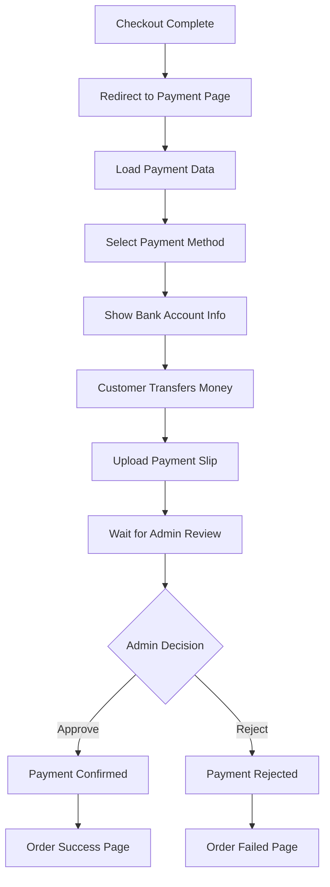
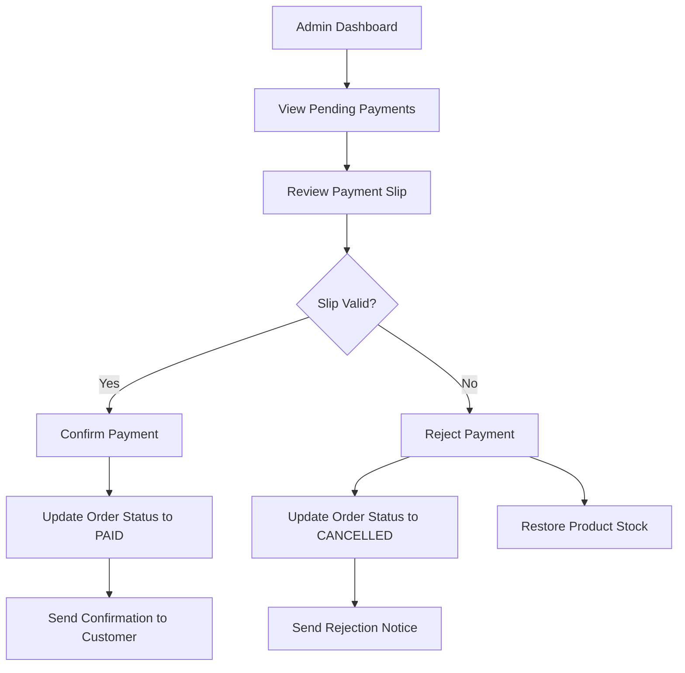

# Payment System Guide

## ระบบชำระเงินสำหรับ E-commerce

> คู่มือการใช้งานและการพัฒนาระบบชำระเงินที่สมบูรณ์

---

## 🎯 Overview

Payment System ประกอบด้วย:

- **Bank Transfer Information** - แสดงข้อมูลบัญชีธนาคาร
- **Slip Upload System** - อัปโหลดสลิปการโอนเงิน
- **Payment Status Management** - จัดการสถานะการชำระเงิน
- **Admin Payment Review** - ระบบตรวจสอบสำหรับ Admin

---

## 📁 File Structure

```
src/
├── app/
│   ├── payment/[paymentId]/
│   │   └── page.js                    # Payment page
│   ├── order/
│   │   ├── success/[orderId]/page.js  # Success page
│   │   └── failed/[orderId]/page.js   # Failed page
│   └── api/
│       ├── payment/
│       │   ├── generate-qr/route.js   # QR generation
│       │   ├── upload-slip/route.js   # Slip upload
│       │   └── [paymentId]/status/route.js # Status check
│       └── admin/payments/
│           ├── route.js               # Admin payment list
│           └── [paymentId]/confirm/route.js # Confirm/Reject
└── module/
    ├── payment/
    │   ├── ClientPaymentPage.js       # Main payment UI
    │   ├── PaymentMethods.js          # Payment method selection
    │   ├── BankTransferInfo.js       # Bank account information
    │   ├── SlipUpload.js             # File upload component
    │   ├── OrderDetails.js           # Order summary
    │   └── PaymentHeader.js          # Page header
    └── order/
        ├── OrderSuccessPage.js        # Success page UI
        └── OrderFailedPage.js         # Failed page UI
```

---

## 🔄 Payment Flow

### 1. Customer Payment Process



### 2. Admin Review Process



---

## 🛠️ Implementation Guide

### 1. Setup Environment Variables

```env
# .env.local
NEXTAUTH_SECRET=your_secret_here
NEXTAUTH_URL=http://localhost:3000

# Database
DATABASE_URL="your_database_url"

# File Upload (optional)
UPLOAD_MAX_SIZE=5242880  # 5MB
```

### 2. Database Schema

ตาราง `payments` ต้องมีฟิลด์:

```sql
payments:
- id (PK)
- order_id (FK)
- amount (DECIMAL)
- status (ENUM: WAITING, CONFIRMED, REJECTED)
- slip_url (VARCHAR) - URL ของสลิปที่อัปโหลด
- payment_date (TIMESTAMP) - วันที่อัปโหลดสลิป
- confirmed_at (TIMESTAMP) - วันที่ยืนยัน
- created_at, updated_at
```

### 3. File Upload Configuration

สร้างโฟลเดอร์สำหรับเก็บไฟล์:

```bash
mkdir -p public/uploads/slips
```

### 4. PromptPay Configuration

แก้ไขเบอร์ PromptPay ใน:

```javascript
// src/app/api/payment/generate-qr/route.js
const promptPayId = "0812345678"; // เปลี่ยนเป็นเบอร์จริง
```

---

## 🎨 UI Components

### 1. PaymentMethods Component

```javascript
// Features:
- Single payment method (Bank Transfer)
- Amount display
- Method description
- Simplified UI
```

### 2. BankTransferInfo Component

```javascript
// Features:
- Display multiple bank accounts
- Copy account numbers and names
- Payment instructions
- Amount display with copy function
```

### 3. SlipUpload Component

```javascript
// Features:
- Drag & drop file upload
- File validation (image, <5MB)
- Image preview
- Upload progress
- Error handling
```

### 4. OrderDetails Component

```javascript
// Features:
- Payment status display
- Order summary
- Customer information
- Order items list
```

---

## 🔧 API Endpoints

### 1. Upload Slip

```javascript
POST /api/payment/upload-slip
FormData: {
  "slip": File,
  "paymentId": "456"
}

Response: {
  "success": true,
  "slipUrl": "/uploads/slips/slip_456_1234567890.jpg",
  "message": "Slip uploaded successfully"
}
```

### 2. Check Payment Status

```javascript
GET /api/payment/456/status

Response: {
  "success": true,
  "status": "WAITING",
  "slipUrl": "/uploads/slips/...",
  "confirmedAt": null,
  "updatedAt": "2024-01-01T10:00:00Z"
}
```

### 3. Admin Confirm Payment

```javascript
POST /api/admin/payments/456/confirm
Body: {
  "action": "confirm", // or "reject"
  "note": "Payment verified"
}

Response: {
  "success": true,
  "message": "Payment confirmed successfully"
}
```

---

## 🔒 Security Features

### 1. File Upload Security

```javascript
// Validation checks:
- File type: only images (jpg, png, gif)
- File size: maximum 5MB
- File name: sanitized with timestamp
- Upload path: restricted to /uploads/slips/
```

### 2. Payment Verification

```javascript
// Security measures:
- Customer can only access their own payments
- Admin authentication required for confirmation
- Payment status validation before updates
- Transaction rollback on errors
```

### 3. Data Protection

```javascript
// Privacy features:
- Sensitive data excluded from API responses
- File access control
- Session-based authentication
- CSRF protection via NextAuth
```

---

## 📱 Mobile Optimization

### 1. Responsive Design

```css
/* Key responsive features: */
- Mobile-first design approach
- Touch-friendly upload areas
- Optimized QR code size
- Readable text on small screens
```

### 2. Mobile-Specific Features

```javascript
// Mobile enhancements:
- Camera integration for slip photos
- One-tap copy for PromptPay number
- Swipe gestures for navigation
- Offline status indicators
```

---

## 🧪 Testing Guide

### 1. Payment Flow Testing

```javascript
// Test scenarios:
1. Complete payment with Bank Transfer
2. Upload valid slip image
3. Upload invalid file (should fail)
4. Check payment status polling
5. Admin confirm/reject flow
6. Stock restoration on rejection
```

### 2. Error Handling Testing

```javascript
// Error scenarios:
1. Network failures during upload
2. Invalid file formats
3. Oversized files
4. Duplicate payment attempts
5. Payment timeout scenarios
```

---

## 🚀 Deployment Checklist

### 1. Production Setup

- [ ] Configure real bank account information
- [ ] Set up file storage (local/cloud)
- [ ] Configure proper CORS settings
- [ ] Set up SSL certificates
- [ ] Configure backup for uploaded files

### 2. Monitoring Setup

- [ ] Payment success/failure rates
- [ ] File upload error tracking
- [ ] Admin response times
- [ ] Customer satisfaction metrics

---

## 🔧 Customization Options

### 1. Payment Methods

```javascript
// Add new payment methods:
- Credit/Debit cards
- E-wallets (TrueMoney, Rabbit LINE Pay)
- Installment payments
- Cryptocurrency
```

### 2. Bank Account Display

```javascript
// Customization options:
- Multiple bank accounts
- Bank logos and colors
- Account verification status
- Dynamic account selection
```

### 3. File Storage Options

```javascript
// Storage alternatives:
- AWS S3
- Google Cloud Storage
- Cloudinary
- Local file system
```

---

## 📞 Support & Maintenance

### 1. Common Issues

```javascript
// Troubleshooting:
1. Bank info not displaying → Check component configuration
2. File upload fails → Check permissions
3. Status not updating → Check polling interval
4. Admin can't confirm → Check authentication
```

### 2. Maintenance Tasks

```javascript
// Regular maintenance:
- Clean up old slip files
- Monitor payment success rates
- Update QR code generation
- Review security logs
```

---

## 📈 Future Enhancements

### 1. Planned Features

- [ ] Automatic payment verification via bank APIs
- [ ] Real-time payment notifications
- [ ] Payment analytics dashboard
- [ ] Multi-currency support
- [ ] Subscription payments

### 2. Integration Opportunities

- [ ] Bank API integration
- [ ] Payment gateway services
- [ ] Accounting software sync
- [ ] Customer notification systems

---

_สร้างโดย: E-commerce Development Team_  
_อัปเดตล่าสุด: มกราคม 2024_
